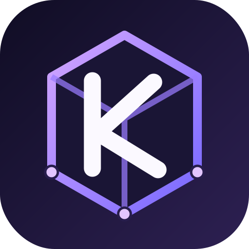

<p align="center">
  
</p>

<h1 align="center">Kura Metadata Store</h1>

Kura Metadata Store is a small, strongly consistent metadata service being
built from first principles. Its long-term role is to provide reusable
coordination primitives for distributed systems and serve as
[Kura Engine](https://github.com/himanshudhawale/kura-engine)'s metadata
authority.

The service is implemented in modern **C++23** for predictable latency,
explicit memory ownership, efficient binary protocols, and direct control over
WAL, networking, and state-machine execution.

> **Current status:** Phase 1 is a single-node, in-memory deterministic state
> machine. A Phase 3 WAL/snapshot storage boundary exists but is not connected
> to mutation responses or a transactional backend. The service is not
> distributed, replicated, durably integrated, or highly available. Do not use
> it for production metadata.

## Why build it?

Distributed systems need a trustworthy place for small, important decisions:

- Which node is the leader?
- Which service instances are alive?
- Which configuration version is current?
- Who owns a job or lease?
- Which immutable database snapshot is canonical?

The final service will expose a compact key-value API with revisions,
compare-and-set transactions, watches, and leases. Raft consensus will replicate
the deterministic state machine across an odd-sized cluster.

## Planned API

```text
get(key)
range(start, end)
put(key, value)
delete(key)
transaction(if comparisons, then operations, else operations)
watch(prefix, fromRevision)
grantLease(ttl)
keepAlive(lease)
revokeLease(lease)
```

The initial code implements versioned `get`, `range`, `put`, `delete`, and one
compare-and-set operation. It establishes semantics for later persistence and
replication; it does not pretend those guarantees already exist.

## Architecture

```text
Client API
    |
    v
+-----------------------------+
| Raft consensus              |  Phase 4
| leader, log, quorum, reads  |
+-----------------------------+
    |
    v committed commands
+-----------------------------+
| Deterministic state machine |  Phases 1-2
| KV, revisions, Txn, Watch   |
+-----------------------------+
    |
    v
+-----------------------------+
| WAL + snapshots + backend   |  Phase 3
+-----------------------------+
```

Only committed Raft commands may eventually reach the state machine. The same
ordered command sequence must produce byte-for-byte equivalent state on every
node.

## Kura Engine compatibility

Kura Engine needs atomic snapshot publication:

```text
compare current table revision == expected revision
then set current snapshot pointer = new immutable manifest
else report a conflict
```

Later, lease-backed reader registrations prevent Kura from garbage-collecting a
snapshot while a query still reads it. Watches notify compute nodes when a new
snapshot becomes current. See [Kura integration](docs/kura-integration.md).

## Documentation

- [Architecture](docs/architecture.md)
- [API and data model](docs/api.md)
- [Kura Engine integration](docs/kura-integration.md)
- [Implementation roadmap](docs/roadmap.md)
- [Correctness traps](docs/correctness-traps.md)
- [Research sources](docs/research-sources.md)
- [ADR-0001: phase claims](docs/decisions/0001-phase-claims.md)
- [ADR-0002: C++23 implementation](docs/decisions/0002-cpp23-implementation.md)
- [ADR-0003: internal Raft implementation](docs/decisions/0003-internal-raft.md)
- [Brand assets and usage](docs/brand.md)
- [Durable WAL and snapshot design](docs/design/0005-durable-wal-snapshots.md)
- [WAL format v1](docs/formats/wal-v1.md)
- [Snapshot format v1](docs/formats/snapshot-v1.md)

## Build

Requirements:

- A C++23 compiler
- CMake 3.25+

```shell
cmake -S . -B build -DCMAKE_BUILD_TYPE=Release
cmake --build build --config Release
ctest --test-dir build -C Release --output-on-failure
```

`--config Release` and `-C Release` are required by multi-configuration
generators such as Visual Studio and harmless for single-configuration builds.

## Contributing

Feature requests and bug reports use structured GitHub forms. Design discussion
is welcome in GitHub Discussions. Start with [CONTRIBUTING.md](CONTRIBUTING.md).

Kura Metadata Store is licensed under [Apache-2.0](LICENSE).
